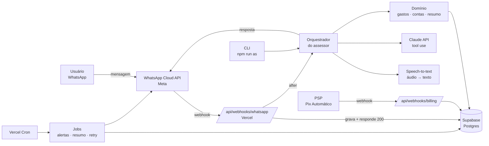

# Arquitetura — Assessor Popular (codinome)

> Status: **Draft v0.1** · 2026-09-25
> Produto: assessor financeiro de IA no WhatsApp para a classe C/D — **R$ 19,90/mês**
> Base: estudo de mercado em `docs/market-research/2026-09-25-meu-assessor.md`
> Nome do produto e domínio: **a definir** (o codinome vale só até lá)

---

## 1. Resumo em 5 linhas

1. O usuário conversa **só pelo WhatsApp**, por texto, áudio ou foto. Não existe app para instalar.
2. Uma **IA com ferramentas** (tool use) registra gastos, contas a pagar e responde perguntas.
3. Os dados ficam no **Supabase** (banco Postgres com login, arquivos e filas), e o código roda na **Vercel** (Next.js). É a mesma stack do projeto `apps/jotatech`.
4. **CLI First:** todo o domínio funciona pelo terminal (`npm run as -- chat ...`) antes de ligar o WhatsApp.
5. **O custo por usuário é tratado como requisito.** O orçamento de IA e de mensagens é medido e limitado por usuário.

---

## 2. Escopo do MVP (Fase 1)

| # | Funcionalidade | Exemplo |
|---|---|---|
| F1 | Onboarding no WhatsApp com consentimento LGPD e 7 dias grátis | "Oi" → aceite → nome → pronto |
| F2 | Registrar gasto/receita por **texto** | "gastei 32 no mercado" |
| F3 | Registrar por **áudio** (convertido em texto) | Áudio de 10s |
| F4 | Registrar por **foto** (cupom ou boleto) | Foto do cupom fiscal |
| F5 | Perguntas sobre o próprio dinheiro | "quanto gastei com lanche esse mês?" |
| F6 | Contas a pagar + **alerta antes do vencimento** | "luz vence dia 10, 180 reais" |
| F7 | Resumo semanal | Domingo: "Você gastou R$ X, Y a mais que semana passada" |
| F8 | Assinatura de **R$ 19,90/mês** (Pix Automático, com cartão como alternativa) | Link de pagamento no próprio chat |
| F9 | **Cancelar com uma mensagem** | "cancelar" → confirmação → cancelado |
| F10 | **Apagar meus dados** (LGPD) | "apagar meus dados" → confirmação → apagado |

**Fora do MVP:**
- **Fase 2:** grupo da família, metas, modo "sair do vermelho" (plano de dívidas), indicação de amigos.
- **Fase 3:** Open Finance em modo só leitura (via agregador) e pagar contas por Pix via ITP (iniciador de pagamento autorizado pelo BCB; exige parceiro licenciado).

---

## 3. Visão geral



---

## 4. Camadas (hexagonal, simples)

```
apps/assessor/
├── src/
│   ├── core/                 # DOMÍNIO — funções puras, sem I/O
│   │   ├── money.ts          # centavos, parse "32,50" → 3250
│   │   ├── categories.ts     # lista fixa de categorias
│   │   ├── transactions.ts   # regras de gasto/receita
│   │   ├── bills.ts          # contas, recorrência, "vence em N dias"
│   │   ├── summary.ts        # resumo semanal/mensal
│   │   └── subscription.ts   # trial, ativo, inadimplente, cancelado
│   ├── agent/                # CÉREBRO — IA + ferramentas
│   │   ├── orchestrator.ts   # recebe msg normalizada → decide → responde
│   │   ├── prompt.ts         # system prompt fixo (cacheável)
│   │   ├── tools.ts          # registrar_transacao, consultar, criar_conta...
│   │   └── budget.ts         # limite de custo por usuário/mês
│   ├── channels/             # ENTRADA/SAÍDA
│   │   ├── whatsapp/         # parse do webhook, envio, templates
│   │   └── cli/              # mesmo contrato, pelo terminal
│   ├── infra/                # ADAPTADORES externos
│   │   ├── db/               # repositórios Supabase
│   │   ├── llm.ts            # cliente Claude
│   │   ├── stt.ts            # speech-to-text
│   │   └── billing.ts        # PSP (Pix Automático)
│   └── app/                  # Next.js — só rotas finas
│       ├── api/webhooks/whatsapp/route.ts
│       ├── api/webhooks/billing/route.ts
│       ├── api/cron/[job]/route.ts
│       └── (site)/           # landing + página de pagamento
├── scripts/as.mjs            # CLI
├── supabase/migrations/      # schema versionado
└── tests/
```

**Regra de ouro:** `core/` não importa nada de `infra/` nem de `channels/`. O WhatsApp e a CLI chamam **o mesmo** `orchestrator`.

---

## 5. Fluxo de uma mensagem

1. **Webhook** recebe o POST da Meta e valida a assinatura (`X-Hub-Signature-256`).
2. **Idempotência:** grava em `messages` com `wa_message_id UNIQUE`. Se a mensagem já existe, só responde 200.
3. Responde **200 na hora**, porque a Meta reenvia a mensagem se a resposta demorar.
4. Processa depois, com `after()` do Next.js:
   - áudio → STT → texto
   - imagem → vai para o Claude como imagem (o modelo lê imagens)
   - carrega o contexto: perfil, resumo da conversa e as últimas N mensagens
   - chama o Claude com as **ferramentas** → executa as ferramentas no domínio → gera a resposta final
5. Envia a resposta. Como o usuário acabou de escrever, a resposta cai na **janela de 24h e é grátis**.
6. Registra em `usage_events` os tokens, os segundos de áudio e o custo estimado.
7. **Rede de segurança:** um cron roda a cada 5 min e reprocessa mensagens paradas em `status = 'received'` há mais de 2 min.

---

## 6. Ferramentas da IA (tool use)

| Ferramenta | Faz | Lógica em |
|---|---|---|
| `registrar_transacao` | Grava gasto/receita (valor, categoria, descrição, data) | `core/transactions` |
| `consultar_transacoes` | Soma/lista por período e categoria | `core/transactions` |
| `desfazer_ultima` | Apaga o último registro ("errei") | `core/transactions` |
| `criar_conta_pagar` | Conta com vencimento e recorrência | `core/bills` |
| `listar_contas` | Próximas contas a vencer | `core/bills` |
| `marcar_conta_paga` | Dá baixa numa conta | `core/bills` |
| `resumo` | Resumo do período | `core/summary` |
| `assinatura` | Status, link de pagamento, cancelar | `core/subscription` |
| `apagar_dados` | LGPD: apaga tudo, com confirmação em 2 passos | `infra/db` |

- Ferramentas com `strict: true` (o schema é validado sempre).
- Ações destrutivas (`apagar_dados`, cancelar assinatura) **pedem confirmação** e nunca rodam direto.

---

## 7. Modelo de dados (Supabase / Postgres)

```sql
users            (id uuid pk, phone_e164 text unique, name text,
                  consent_at timestamptz, trial_ends_at timestamptz,
                  plan_status text check (plan_status in ('trial','active','past_due','canceled')),
                  timezone text default 'America/Sao_Paulo', created_at, deleted_at)

subscriptions    (id, user_id fk, psp text, psp_subscription_id text unique,
                  price_cents int default 1990, status text, current_period_end timestamptz,
                  canceled_at timestamptz, created_at)

messages         (id, user_id fk, direction text in ('in','out'), wa_message_id text unique,
                  kind text in ('text','audio','image','template'), body text, media_path text,
                  status text in ('received','processing','done','failed'),
                  error text, created_at)

transactions     (id, user_id fk, kind text in ('expense','income'), amount_cents int check (> 0),
                  category text, description text, occurred_on date,
                  source text in ('text','audio','image'), message_id fk, created_at, deleted_at)

bills            (id, user_id fk, description text, amount_cents int, due_on date,
                  recurrence text in ('none','monthly'), status text in ('open','paid'),
                  last_reminded_at timestamptz, created_at)

conversation_state (user_id pk fk, summary text, updated_at)   -- memória resumida

usage_events     (id, user_id fk, kind text in ('llm','stt','wa_template'),
                  input_tokens int, cached_tokens int, output_tokens int,
                  audio_seconds int, cost_micro_usd bigint, created_at)
```

- **Dinheiro sempre em centavos (`int`)**, nunca `float`.
- **RLS ligado** em todas as tabelas. O backend acessa com `service_role`, e o painel futuro vai usar RLS por usuário.
- Mídia (áudio/foto) no **Supabase Storage**, apagada depois de 30 dias. O texto extraído fica.

---

## 8. Custo como requisito (guardrails)

| Controle | Regra inicial |
|---|---|
| Orçamento de IA por usuário | Teto de **US$ 0,50/mês**. Se passar, responde mais curto e sem foto |
| Limite de mensagens | 60/dia por usuário (evita abuso) |
| Prompt caching | System prompt + ferramentas fixos no começo, com `cache_control` |
| Histórico | Últimas 10 mensagens + `conversation_state.summary` |
| Mensagem ativa (template, paga) | No máximo **~8/mês** por usuário. Alerta e resumo saem dentro da janela de 24h quando der |
| Áudio | Máx. 2 min por áudio. STT custa ~US$ 0,003–0,008/min |
| Painel de custo | `npm run as -- costs` mostra o custo por usuário no mês |

**Meta de custo variável:** ≤ R$ 5 por usuário/mês, uns 25% de R$ 19,90.

---

## 9. Pagamento (R$ 19,90)

- **Pix Automático** (débito recorrente via Pix; ~85% dos bancos já aceitam) através de um **PSP**.
- **Cartão** como alternativa.
- Fluxo:
  1. O trial acaba.
  2. O assessor manda o link.
  3. O usuário autoriza no app do banco.
  4. O webhook do PSP muda `plan_status` para `active`.
- Inadimplente (`past_due`): o assessor continua respondendo por 3 dias com aviso, depois só aceita "pagar" e "cancelar".
- **Cancelar:** mandar "cancelar" → confirmação → cancela no PSP → `canceled`. O acesso segue até o fim do período pago.

---

## 10. Segurança e LGPD

- Validar a assinatura de **todos** os webhooks (Meta e PSP).
- Segredos só em variáveis de ambiente na Vercel. `.env.example` sem valores.
- Consentimento explícito no onboarding (`consent_at`), com link para a política de privacidade.
- "Apagar meus dados": remove de verdade em até 24h (job) e confirma por mensagem.
- Logs **sem** conteúdo de mensagem nem número completo (mascarar `+55 11 9****-1234`).
- O modelo nunca recebe dados de outro usuário. Toda ferramenta filtra por `user_id` vindo do servidor, nunca do texto.

---

## 11. CLI (CLI First)

```
npm run as -- status                         # testa Supabase, Meta, LLM, PSP
npm run as -- chat +5511999990000 "gastei 20 no pão"   # conversa sem WhatsApp
npm run as -- users [busca]                  # lista usuários
npm run as -- user +5511...                  # detalhe + gastos + status
npm run as -- costs [--month 2026-10]        # custo por usuário
npm run as -- jobs run reminders|summary|retry
npm run as -- subscription cancel +5511...
npm run as -- delete-user +5511...           # LGPD manual
```

`chat` usa o **mesmo orquestrador** do WhatsApp, e a resposta sai no terminal. Assim dá para desenvolver e testar tudo sem a Meta.

---

## 12. Testes

- `core/`: testes unitários puros, de parse de valor, categorias, recorrência e resumo.
- `agent/`: **conjunto de avaliação** com ~50 frases reais ("gastei 32,50 no mercado ontem"), conferindo a ferramenta chamada e os argumentos.
- Webhooks: assinatura inválida → 401; mensagem repetida → sem duplicar.
- Comandos iguais aos do `apps/jotatech`: `npm run typecheck`, `npm test`, `npm run build`.

---

## 13. Decisões em aberto (precisam do dono)

| # | Decisão | Recomendação | Por quê |
|---|---|---|---|
| D1 | Nome e domínio | — | Marca |
| D2 | Modelo de IA | **Claude Haiku 4.5** (US$ 1 / US$ 5 por MTok) com fallback para Sonnet 5 em perguntas difíceis | Custo por usuário cabe na meta. Confirmar com testes reais (eval) |
| D3 | Speech-to-text | OpenAI `gpt-4o-mini-transcribe` (~US$ 0,003/min) ou Groq Whisper | Barato e bom em pt-BR. Testar com áudios reais |
| D4 | PSP para Pix Automático | **Asaas** | Tem Pix Automático via API e é focado em PME. Taxa R$ 1–3 por cobrança |
| D5 | Onde fica o código | `apps/assessor` neste monorepo (igual ao `apps/jotatech`) ou repositório separado | Repositório separado deixa deploy e acesso mais simples |
| D6 | Número de WhatsApp | Número novo, dedicado, com verificação de empresa na Meta | Obrigatório para a Cloud API |

---

## 14. Plano de stories (Epic AS-1 — MVP)

| Story | Entrega | Depende de |
|---|---|---|
| AS-1.1 | Esqueleto do app + Supabase + migrations + CLI `status` | D5 |
| AS-1.2 | Domínio `core/` (dinheiro, transações, contas, resumo) + testes | 1.1 |
| AS-1.3 | Orquestrador + ferramentas + `as chat` (sem WhatsApp) + eval de 50 frases | 1.2, D2 |
| AS-1.4 | Webhook WhatsApp (texto) + idempotência + retry | 1.3, D6 |
| AS-1.5 | Áudio (STT) e foto (visão) | 1.4, D3 |
| AS-1.6 | Contas a pagar + cron de alertas + resumo semanal | 1.4 |
| AS-1.7 | Assinatura R$ 19,90 (Pix Automático) + cancelar por mensagem | 1.4, D4 |
| AS-1.8 | LGPD: consentimento, apagar dados, mascarar logs + controle de custo | 1.4 |
| AS-1.9 | Landing page + checkout | 1.7, D1 |

Fluxo AIOX para cada story: `@sm` cria → `@po` valida → `@dev` implementa → `@qa` gate → `@devops` push.

---

## Fontes

- Estudo de mercado: `docs/market-research/2026-09-25-meu-assessor.md`
- Preço WhatsApp API BR 2026: https://www.socialhub.pro/blog/preco-whatsapp-api-2026-brasil/
- Pix Automático (Asaas): https://docs.asaas.com/docs/pix-automatico · https://forjadesistemas.com.br/blog/pix-automatico-recorrencia-saas-proprio-2026/
- Speech-to-text preços 2026: https://tokenmix.ai/blog/whisper-api-pricing · https://dev.to/pietrus914/speech-to-text-api-comparison-whisper-api-options-in-2026-400h
- Preço Claude: https://platform.claude.com/docs/en/about-claude/pricing
